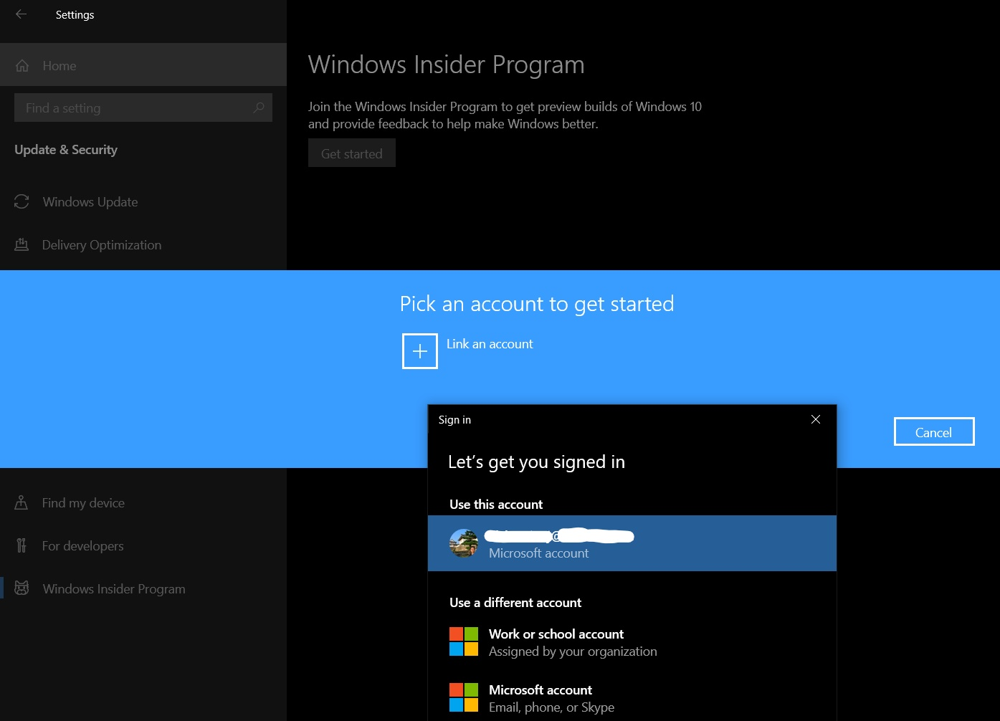
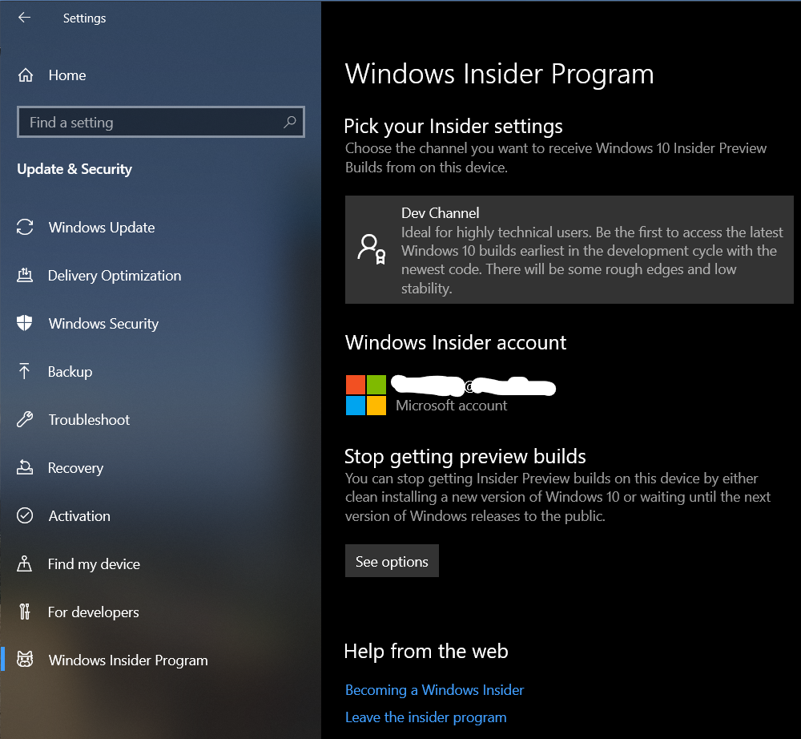
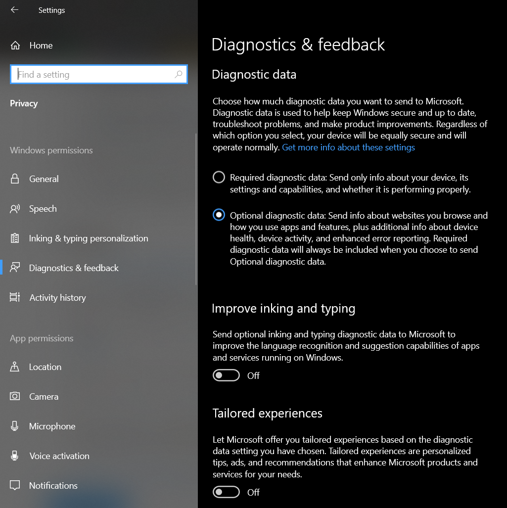
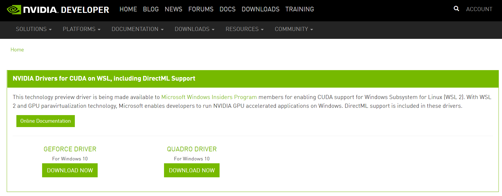
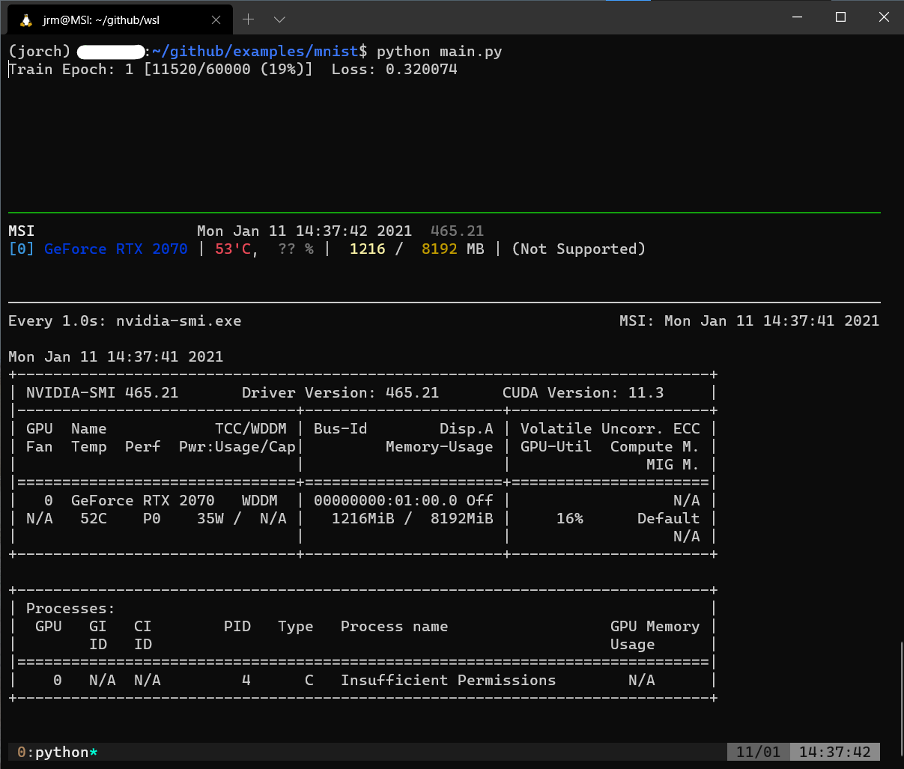

You can now use CUDA (PyTorch/Tensorflow) under Windows Subsystem Linux (WSL)!
Although the CUDA under WSL does not have the full capacity as it is in an ordinary Linux (e.g., Ubuntu),
it is still worth using now that gaming laptops are very common.

You can read the full instruction on NV's doc [here](https://docs.nvidia.com/cuda/wsl-user-guide/index.html#running-cuda).


## Summary of Procedures
1. Join Windows Insider Program.
2. Install a special version of nVidia Driver for WSL.
3. Install WSL 2
4. Install CUDA toolkit in WSL

<br/>
<hr/>

## Join Windows Insider Program
First, click on the button on the lower left to  [register for the Windows Insider Program](https://insider.windows.com/en-us/getting-started#register).


<br/>
<hr/>

Then, click 
Windows Key > Settings > Update & Security > Windows Insider Program.
Sign in and join the **Dev Channel**. 





<details>
    <summary>
        Make sure you turn on Diagnostic data
    </summary>
    <br>
    
</details>


After registration, remember to update your Windows. It will take a about 20 minutes and several automatic reboots.

<br/>
<hr/>

## Install a special version of nVidia Driver for WSL
Download [NVIDIA Drivers for CUDA on WSL, including DirectML Support](https://developer.nvidia.com/cuda/wsl/download). You will most likely be using GeForce. You will need to register for an nVidia account first.


c

Download the driver and install it. This special version has the same GUI as the ordinary one, except that it enables CUDA under WSL 2.

<br/>
<hr/>

## Install WSL 2
See the procedures [here](README.md).
Note that it has to be WSL 2


## Install CUDA toolkit in WSL
Open your Ubuntu terminal and the following (you will need `su` first, or `sudo` every line of the commands). Here I am following [NV's doc](https://docs.nvidia.com/cuda/wsl-user-guide/index.html#running-cuda) which installs CUDA 11.
```bash
apt-key adv --fetch-keys http://developer.download.nvidia.com/compute/cuda/repos/ubuntu1804/x86_64/7fa2af80.pub

sh -c 'echo "deb http://developer.download.nvidia.com/compute/cuda/repos/ubuntu1804/x86_64 /" > /etc/apt/sources.list.d/cuda.list'

apt-get update

apt-get install -y cuda-toolkit-11-0
```

<br/>
<hr/>

## Verify your CUDA on WSL 2
Finally (but optionally), you should verify your CUDA installation.
```bash
cd /usr/local/cuda/samples/4_Finance/BlackScholes

# sudo
make

./BlackScholes
```

If you see a `Test passed` message, you can enjoy your CUDA with WSL 2! Install your conda environment give Pytorch a try on your gaming laptop!

Here's what it looks like training a simple model on MNIST using PyTorch. Training looks good. `gpustat` is running although it cannot show the user/process using GPU RAM. Note that you need to use `nvidia-smi.exe` in WSL instead.


