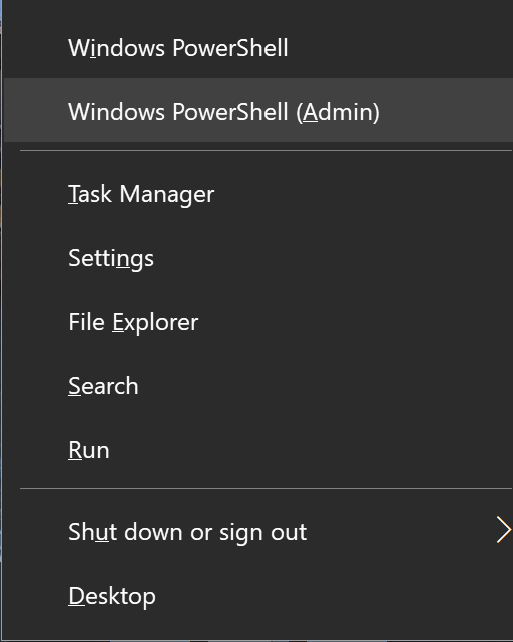
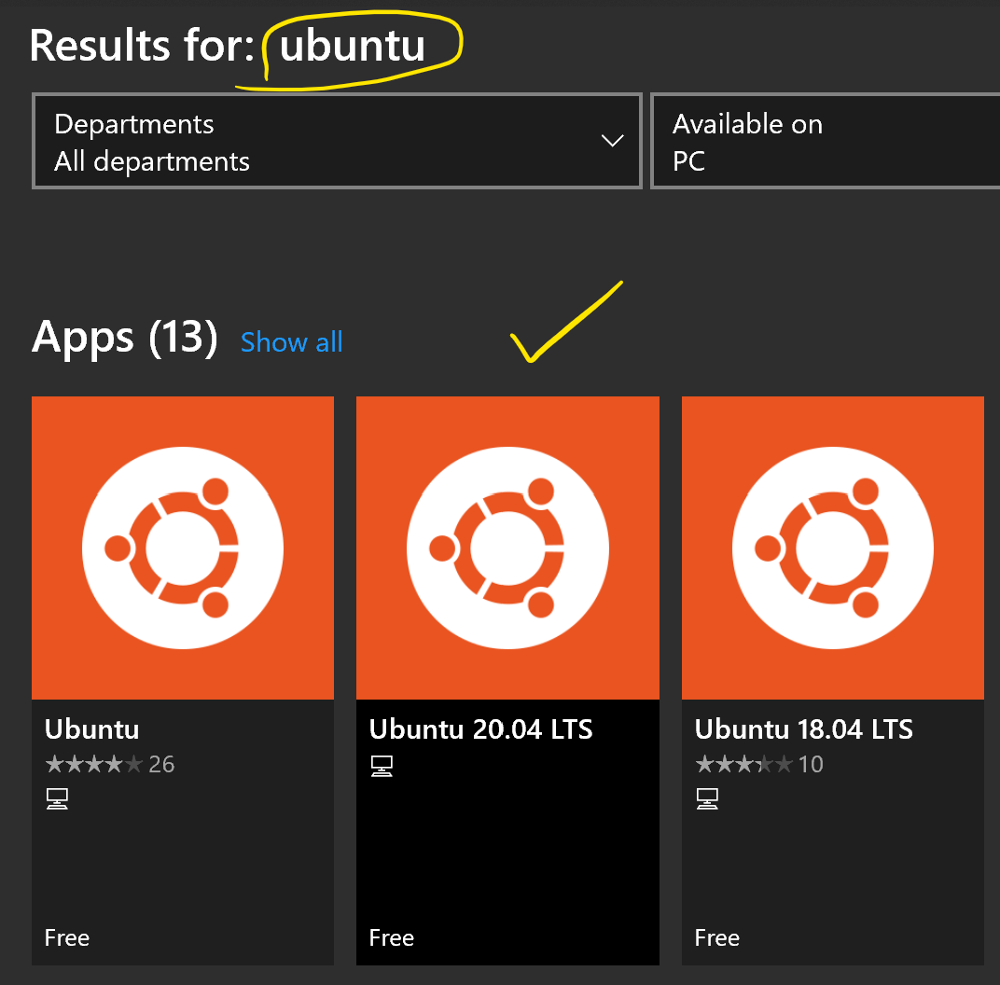
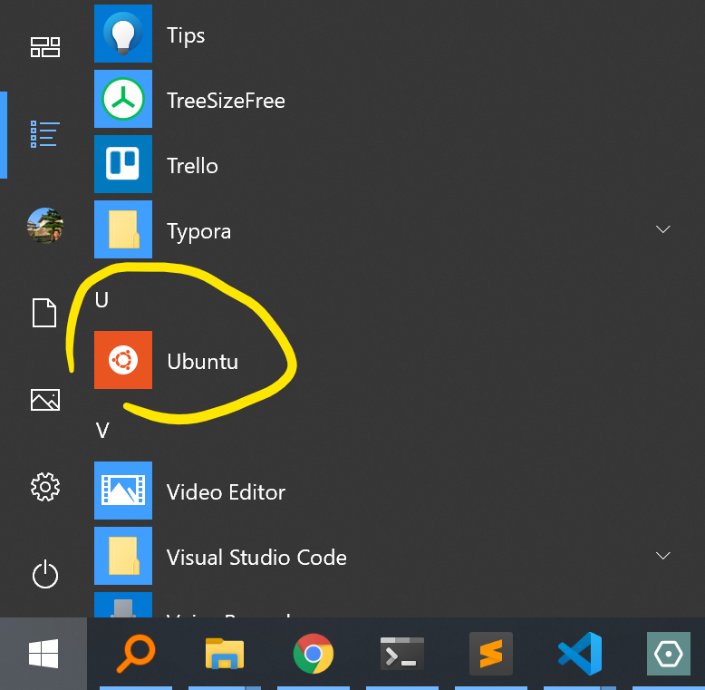

As simple as 5 steps, Windows users can now enjoy Linux command lines (and a whole subsystem) without the hassle of installing and logging to dual systems.


# Steps
1. Press Win+X, launchd PowerShell **as Administrator**  


2. Execute this: (read the manual on [Microsoft's official site](https://docs.microsoft.com/en-us/windows/wsl/install-win10) if you need to know why)
```
dism.exe /online /enable-feature /featurename:Microsoft-Windows-Subsystem-Linux /all /norestart
```

3. Open Microsoft Store
4. Install a Linux distribution you like (e.g., `Ubuntu`, `Ubuntu 20.04`, etc)  


5. Voila! You can use it now!



# Tips
- You can find all files in your PC under `/mnt/c`.
- External drives (e.g., SD cards) are not mounted by default.
- WSL interoperates with `cmd`. For example, you can open the current directory (`.`) with Windows File Explorer by `explorer.exe .` 

